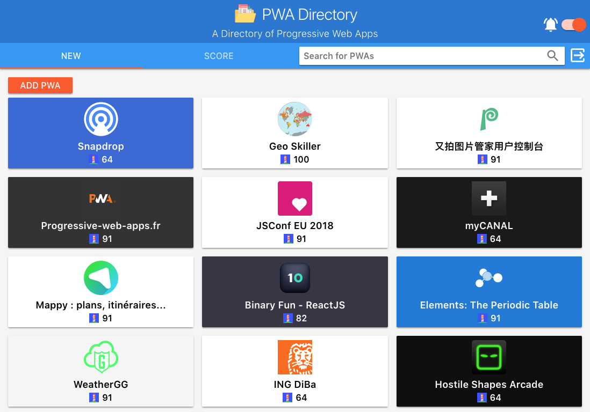
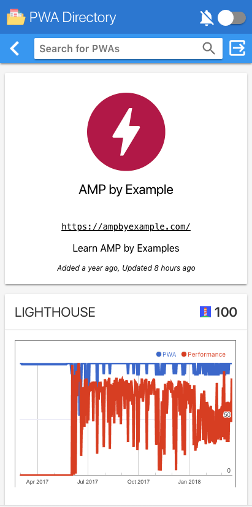
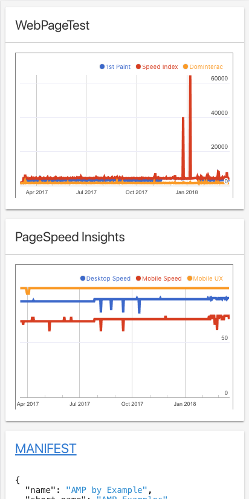

# Gulliver 

[Gulliver](https://pwa-directory.appspot.com/) is a directory of [Progressive Web Apps](https://infrequently.org/2016/09/what-exactly-makes-something-a-progressive-web-app/).

## Contents

In Gulliver's landing page you can browse the set of currently registered PWAs as depicted in the following landing page snapshot:

If you click on any particular PWA you want, Gulliver takes you to a detail page showing the results of an evaluation done on that specific PWA using the  [Lighthouse PWA Analyzer](https://www.youtube.com/watch?v=KiV2p46rWjU) tool (Details page #1), and a view of the associated [web app manifest](https://developer.mozilla.org/en-US/docs/Web/Manifest) file  for the application (Details Page #2):

Details Page #1            |  Details Page #2
:-------------------------:|:-------------------------:
  |  

Gulliver itself has been implemented as a PWA; therefore it is designed to work well in any kind of device, including desktop web browsers (see landing page), and in mobile devices (see details page).

## FAQ

[Visit our FAQ Page](https://github.com/GoogleChrome/gulliver/blob/master/FAQ.md)

## Requirements

Gulliver was built using the [ExpressJS](https://expressjs.com/) web framework for Node.js, and uses the [Google Cloud Platform](https://cloud.google.com/) (GCP) for computing and storage services. Therefore, the following components are required to run the project:

1. [NodeJS](https://nodejs.org) (~6.0.0). A JavaScript runtime built on Chrome's V8 JavaScript engine.

1. [Google Cloud SDK](https://cloud.google.com/sdk/). A set of tools for GCP that you can use to access the Google Compute Engine and the Google Cloud Storage, which are two components of GCP used by Gulliver.

1. A [Google Cloud Console](https://console.cloud.google.com/) project. A GCC project forms the basis of accessing the GCP. 

1. [Memcached](https://memcached.org/). A distributed memory object caching system.

## Running Gulliver

To run Gulliver locally the following steps must be followed:

1. **Clone** the GitHub repository: `git clone https://github.com/GoogleChrome/gulliver.git`

1. Switch into the project directory: `cd gulliver`

1. Create a **Google Cloud Console project**. You can check the Cloud Platform Console [documentation](https://support.google.com/cloud/answer/6251787) for instructions on how to do it.

1. Create indexes for the [Google Cloud Datastore](https://cloud.google.com/datastore/docs/concepts/overview): `gcloud preview datastore create-indexes index.yaml`

1. Deploy cron jobs for scheduled PWA updates (optional): `gcloud app deploy cron.yaml`

1. Install **Memcached** and run it on `localhost:11211`. Check these [installation instructions](https://cloud.google.com/appengine/docs/flexible/nodejs/caching-application-data) for guidance.

1. Edit the [`config/config.json`](config/config.json) file to contain the
information associated with your Google Cloud Console project. Alternatively, you can set environment variables corresponding to those defined in the config file.

1. Run **`gcloud init`** to setup your project.

1. Run **`npm i`** to install the dependencies declared in `package.json`

1. Run **`npm start`** to start the project; the default port used is `8080` but you can specify another port by running `PORT=<your-port> npm start`

1. Access the URL `localhost:8080` or `localhost:<your-port>` from your browser.

## Running Tests

To verify that everything is working properly you can run the project's tests:

1. `npm test` to run lint + tests + coverage report.
2. `npm run mocha` to run all the tests only.
3. `npm run coverage` to run tests + coverage report.

## Lighthouse PWA Analyzer

Gulliver reports an evaluation of the "progressiveness" of each registered PWA. This evaluation is done by Lighthouse, which is a tool that runs a set of checks validating the existence of the features, capabilities, and performance that should characterize a PWA. You can learn more about Lighthouse in the [GitHub repository](https://github.com/GoogleChrome/lighthouse), or in this [video](https://www.youtube.com/watch?v=KiV2p46rWjU).

## References

To find out more about what PWAs are and how to go about incorporating the principles of PWAs into the development of your applications, check the following references which provide introductory information and references:

+ [Progressive Web Apps](https://developers.google.com/web/#progressive-web-apps): Documentation entry point. Here you will find several resources to get started developing PWAs

+ [Progressive Web Apps: Escaping Tabs without Losing our Soul](https://infrequently.org/2015/06/progressive-apps-escaping-tabs-without-losing-our-soul/): 
Introductory article with historical perspective

+ [Getting Started with Progressive Web Apps](https://addyosmani.com/blog/getting-started-with-progressive-web-apps/): Sound introduction on the fundamental elements behind the development of PWAs

+ [The Building Blocks of PWAs](https://www.smashingmagazine.com/2016/09/the-building-blocks-of-progressive-web-apps/): Interesting overall view of PWAs. 

## License

See [LICENSE](./LICENSE) for more.

## Disclaimer

This is not a Google product.
