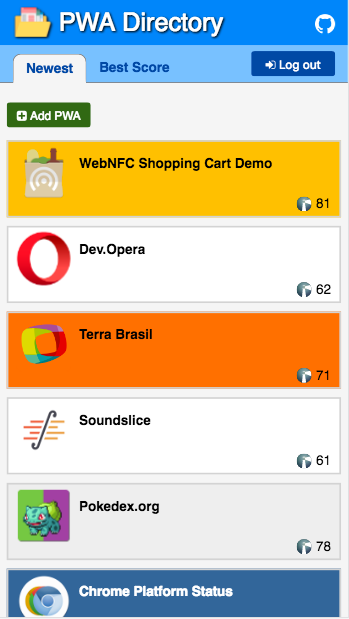
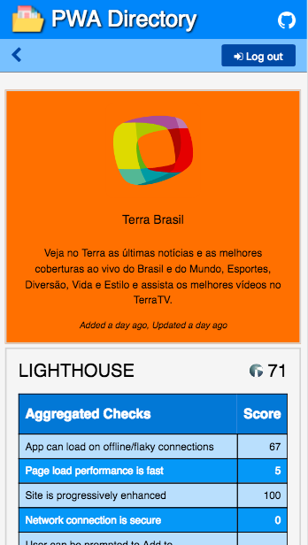

# Gulliver 

Progressive Web App (PWA) is an umbrella term used to define web applications that use modern web development technologies to provide user experiences matching those of native mobile apps. Another way to express the definition is: “A PWA is a model for creating app-like experiences using the latest Web Technologies progressively”.  The progressive  aspect indicates that the apps will provide progressively-enhanced user experiences as new and more advanced features become available in the platforms they run on.

PWAs seek to provide native-app-like behavior and characteristics in web apps, in order to improve user retention and performance, while at the same time eliminating the disadvantages of developing and maintaining a native app. By providing an app-like experience from a web development platform, PWAs are able to provide significant value on several dimensions

The [Gulliver project](https://pwa-directory.appspot.com/), provides a directoy of existing Progressive Web Apps (PWAs).

## Contents

In Gulliver's landing page you can browse the set of currently registered PWAs as depicted in the following landing page snapshot:



If you click on any particular PWA you want, Gulliver takes you to a detail page showing the results of an evaluation done on that specific PWA using the [Lighthouse PWA Analyzer](https://www.youtube.com/watch?v=KiV2p46rWjU) tool, and a view of the associated [web app manifest](https://developer.mozilla.org/en-US/docs/Web/Manifest) file for the application:




## Requirements

The following components are required to run the project:

1. [NodeJS](https://nodejs.org). 
1. [Google Cloud SDK](https://cloud.google.com/sdk/)
1. A [Google Cloud Console](https://console.cloud.google.com/) project.
1. Memcached installed and running on localhost:11211. [Installation instructions](https://cloud.google.com/appengine/docs/flexible/nodejs/caching-application-data).

## Installation

1. Clone this GitHub repository on your computer.

```
$ git clone https://github.com/GoogleChrome/gulliver.git
```

2. ```cd gulliver```

2. Edit the [`config/config.json`](config/config.json) file to contain the
information appropriate to your project. Alternatively, you can set environment variables corresponding to those defined in this file.

3. Run `gcloud init` to setup your project.
4. Run `npm i` to install the dependencies declared in `package.json`
5. Run `npm start` to start the project; the default port used is `8080` but
   you can specify another port by running `PORT=<your-port> npm start`
6. Hit the URL `localhost:8080` or `localhost:<your-port>`

## Running Tests

1. `npm test` to run lint + tests + coverage report.
2. `npm run mocha` to run all the tests only.
3. `npm run coverage` to run tests + coverage report.

## References

If you are interested in finding out more about what PWAs are and how to go about incorporating the principles of PWAs into the development of your applications, check the following references which might be helpful:

+ [Progressive Web Apps](https://developers.google.com/web/#progressive-web-apps): Documentation entry point. Here you will find several resources to get started developing PWAs

+ [Progressive Web Apps: Escaping Tabs without Losing our Soul](https://infrequently.org/2015/06/progressive-apps-escaping-tabs-without-losing-our-soul/): 
Introductory article with historical perspective

+ [Getting Started with Progressive Web Apps](https://addyosmani.com/blog/getting-started-with-progressive-web-apps/): Sound introduction on the fundamental elements behind the development of PWAs

+ [The Building Blocks of PWAs](https://www.smashingmagazine.com/2016/09/the-building-blocks-of-progressive-web-apps/): 
Interesting overall view of what PWAs are 


## License

See [LICENSE](./LICENSE) for more.

This is not a Google product.
